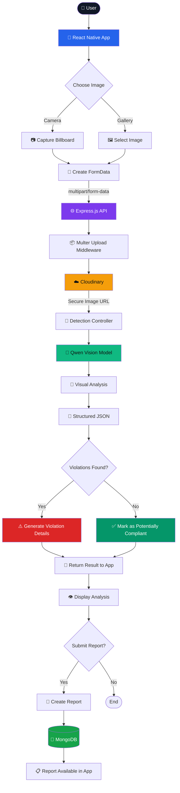
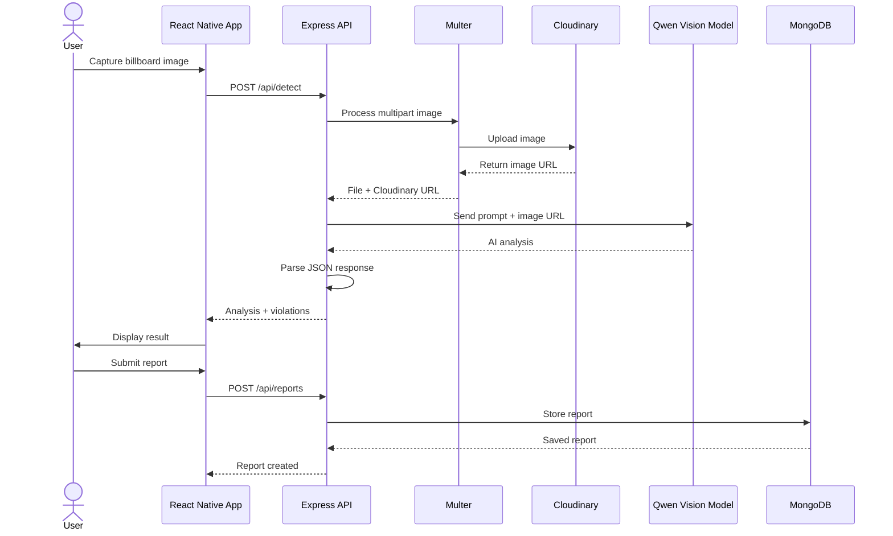
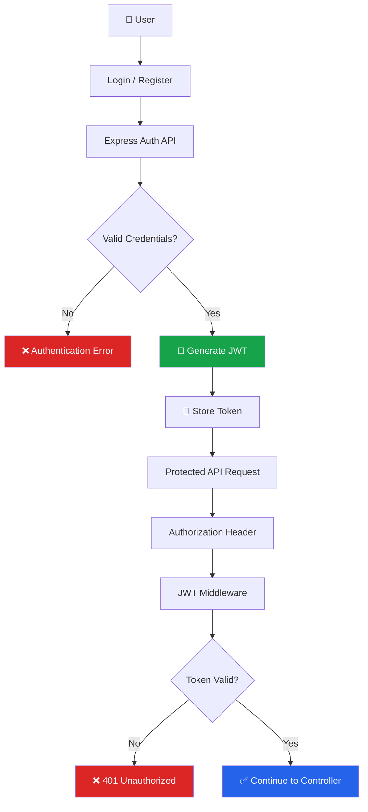

# 🏙️AI-Powered Billboard Violation Detection & Reporting System
BillboardReportApp is a mobile-based AI system designed to help identify potentially non-compliant billboards and advertising displays from photographs.

Users can capture or upload a billboard image through the mobile application. The image is securely uploaded to cloud storage, analyzed by a vision-language AI model, and the detected violations are returned to the application in a structured format.

The system combines **React Native, Node.js, Express.js, MongoDB, Cloudinary, OpenCV and Qwen Vision AI** into a complete image-analysis and reporting workflow.

---

## ✨ Key Features

* 📸 **Billboard Image Capture**

  * Capture billboard photographs directly from the mobile application.
  * Supports image upload from the device.

* 🤖 **AI-Powered Violation Detection**

  * Uses a Qwen vision-language model to analyze billboard images.
  * Identifies potential violations based on visual information.

* 🔍 **Computer Vision Processing**

  * Qwen3.8-27B - based image-processing capabilities.
  * Image preprocessing can be incorporated before AI analysis.

* ☁️ **Cloud Image Storage**

  * Images are uploaded through the backend.
  * Cloudinary handles image storage and delivery.

* 📋 **Structured AI Results**

  * AI responses are converted into structured JSON.
  * Violations are categorized into areas such as:

    * Size
    * Location
    * Content

* 📝 **Report Management**

  * Users can create and view billboard reports.
  * Reports are persisted in MongoDB.

* 🔐 **Authentication**

  * JWT-based authentication.
  * Authenticated requests can send the token through the `Authorization` header.

* 📱 **Mobile-First Application**

  * Built using React Native with Expo.
  * Designed to work across Android and web development environments.

* 🌐 **REST API Architecture**

  * Frontend communicates with the Express backend through REST endpoints.

---

# 🧠 How It Works

The application follows a simple end-to-end pipeline:

```text
User
  │
  ▼
Capture / Select Billboard Image
  │
  ▼
React Native Application
  │
  │ multipart/form-data
  ▼
Express.js Backend
  │
  ▼
Multer Upload Middleware
  │
  ▼
Cloudinary
  │
  │ Image URL
  ▼
AI Detection Controller
  │
  ▼
Qwen Vision-Language Model
  │
  ▼
Structured JSON Analysis
  │
  ├── Analysis
  └── Violations
        │
        ▼
React Native Application
        │
        ▼
Display Detection Result
        │
        ▼
Create / Store Report
        │
        ▼
MongoDB
```

---

# 🔄 System Flow



---

# 🧰 Tech Stack

| Layer                | Technology                 |
| -------------------- | -------------------------- |
| Mobile Frontend      | React Native               |
| Development Platform | Expo                       |
| Backend              | Node.js                    |
| API Framework        | Express.js                 |
| Authentication       | JWT                        |
| File Upload          | Multer                     |
| Database             | MongoDB Atlas              |
| Image Storage        | Cloudinary                 |
| Computer Vision      | Qwen3.8-27B                |
| AI Model             | Qwen Vision-Language Model |
| AI Gateway           | Hugging Face Router        |
| HTTP Client          | Axios                      |
| Local Storage        | AsyncStorage               |
| API Format           | REST / JSON                |
| Image Transfer       | Multipart FormData         |

---

# 📂 Project Structure

```text
BillboardReportApp/
│
├── backend/
│   ├── config/
│   │   ├── cloudinary.js
│   │   └── database.js
│   │
│   ├── controllers/
│   │   ├── authController.js
│   │   ├── detectionController.js
│   │   └── reportController.js
│   │
│   ├── middleware/
│   │   ├── authMiddleware.js
│   │   └── uploadMiddleware.js
│   │
│   ├── models/
│   │   ├── User.js
│   │   └── Report.js
│   │
│   ├── routes/
│   │   ├── authRoutes.js
│   │   ├── detectionRoutes.js
│   │   └── reportRoutes.js
│   │
│   ├── .env
│   └── index.js
│
├── frontend/
│   ├── assets/
│   ├── components/
│   ├── screens/
│   ├── services/
│   │   └── api.js
│   ├── navigation/
│   ├── App.js
│   └── package.json
│
├── .gitignore
├── package.json
├── package-lock.json
└── README.md
```

> **Note:** The exact internal filenames may evolve as the project is modularized. The architecture above represents the logical separation of the application.

---

# 🚀 Getting Started

## 1. Clone the Repository

```bash
git clone https://github.com/Abhinanda-Shetty/BillboardReportApp.git
cd BillboardReportApp
```

---

## 2. Install Dependencies

### Root dependencies

```bash
npm install
```

### Frontend

```bash
cd frontend
npm install
```

### Backend

Open another terminal:

```bash
cd backend
npm install
```

---

# 🔐 Environment Variables

Create:

```text
backend/.env
```

Example:

```env
PORT=5001

MONGODB_URI=your_mongodb_connection_string

CLOUDINARY_CLOUD_NAME=your_cloudinary_cloud_name
CLOUDINARY_API_KEY=your_cloudinary_api_key
CLOUDINARY_API_SECRET=your_cloudinary_api_secret

HF_TOKEN=your_huggingface_token

JWT_SECRET=your_jwt_secret
```

### ⚠️ Security

Never commit `.env` to GitHub.

The repository should contain only an example configuration such as:

```text
.env.example
```

with placeholder values.

```env
MONGODB_URI=
CLOUDINARY_CLOUD_NAME=
CLOUDINARY_API_KEY=
CLOUDINARY_API_SECRET=
HF_TOKEN=
JWT_SECRET=
```

---

# ▶️ Running the Application

## Run Frontend Only

```bash
cd frontend
npm start
```

Expo will provide options to run the application on the available development platforms.

---

## Run Backend Only

```bash
cd backend
node index.js
```

The backend runs on:

```text
http://localhost:5001
```

---

## Run Frontend + Backend Together

From the project root:

```bash
npm run start:all
```

The root project is configured to run the Expo frontend and Node.js backend concurrently.

---

# 📡 API Endpoints

## Authentication

### Register

```http
POST /api/auth/register
```

Example:

```json
{
  "name": "User",
  "email": "user@example.com",
  "password": "password"
}
```

### Login

```http
POST /api/auth/login
```

Returns an authentication token used for protected API requests.

---

# 🤖 AI Detection API

### Analyze Billboard

```http
POST /api/detect
```

### Request

```text
Content-Type: multipart/form-data
```

Form field:

```text
photo
```

The backend:

1. Receives the image.
2. Validates the uploaded file.
3. Uploads it to Cloudinary.
4. Obtains the hosted image URL.
5. Sends the image and inspection prompt to the Qwen vision model.
6. Parses the AI response.
7. Returns structured detection results.

### Example Response

```json
{
  "success": true,
  "message": "Billboard analyzed successfully",
  "imageUrl": "https://...",
  "analysis": "The image contains a large billboard...",
  "violations": [
    {
      "type": "Location",
      "description": "Potential placement violation..."
    }
  ]
}
```

---

# 📋 Reports API

### Get Reports

```http
GET /api/reports
```

### Create Report

```http
POST /api/reports
```

### Delete Report

```http
DELETE /api/reports/:id
```

Protected requests use:

```http
Authorization: Bearer <JWT_TOKEN>
```

---

# 🧠 AI Detection Pipeline

The AI analysis follows this pipeline:



---

# 🔍 Violation Categories

The AI detection system can classify potential issues into categories such as:

### 📏 Size

Potentially oversized advertising structures based on visible characteristics.

### 📍 Location

Potentially inappropriate placement, such as installation on or near restricted locations.

### 📝 Content

Potentially problematic advertising content based on the configured inspection criteria.

> AI-generated findings should be treated as **potential violations requiring verification**, rather than automatically as legal determinations. Actual billboard regulations vary by jurisdiction.

---

# 🔐 Authentication Flow



---

# 🌐 Mobile → Backend Communication

For development on a physical Android device, the application uses the development machine's local network IP rather than `localhost`.

Example:

```text
Android Device
      │
      │ Wi-Fi / LAN
      ▼
Development PC
      │
      ▼
Express Server :5001
```

The backend listens on:

```text
0.0.0.0:5001
```

This allows devices on the same local network to communicate with the development server.

---

# 🛡️ Error Handling

The backend handles several stages of failure:

```text
Request
  │
  ├── Missing Image
  │       └── 400 Bad Request
  │
  ├── Upload Failure
  │       └── 400 Upload Error
  │
  ├── Missing AI Credentials
  │       └── 500 Configuration Error
  │
  ├── AI / API Failure
  │       └── 500 Detection Error
  │
  └── Successful Detection
          └── 200 JSON Response
```

The AI response is also parsed defensively so that unexpected model formatting does not immediately crash the detection endpoint.

---

# ⚡ Performance

The application is designed around an asynchronous pipeline:

```text
Image Upload
     ↓
Cloud Storage
     ↓
AI Vision Request
     ↓
JSON Parsing
     ↓
Mobile Response
```

The AI inference stage is the primary latency-sensitive component because the image must be sent to the external vision model and analyzed before the result can be returned.

---

# 🎯 Project Goals

The system aims to provide a technical foundation for:

* Faster identification of potentially non-compliant advertising.
* Citizen-assisted reporting.
* AI-assisted preliminary inspection.
* Centralized digital report management.
* Reduced manual effort in initial image screening.
* Scalable integration with future civic or municipal workflows.

---

# 🔮 Future Improvements

* 🗺️ GPS-based billboard location tagging
* 📍 Map-based violation visualization
* 🏛️ Authority/admin dashboard
* 📊 Violation analytics and statistics
* 🔔 Notifications for submitted reports
* 🧠 Specialized billboard detection model
* 📐 Automated visual size estimation
* 🏙️ Municipality-specific rule configuration
* 🌐 Multi-language support
* 📱 Offline report creation and synchronization
* 🔎 Duplicate billboard/report detection
* 📈 Historical violation analytics

---

# 🧪 Development Notes

The project is currently structured as a full-stack prototype combining mobile development, REST APIs, cloud storage, database persistence, and multimodal AI inference.

The AI component provides **visual analysis and potential violation identification**. It should not be interpreted as a substitute for official regulatory inspection or legal determination.

---

# 📌 Project Highlights

| Component           | Implementation                     |
| ------------------- | ---------------------------------- |
| 📱 Mobile App       | React Native + Expo                |
| ⚙️ Backend          | Node.js + Express                  |
| 🤖 AI               | Qwen Vision-Language Model         |
| 👁️ Computer Vision | OpenCV                             |
| ☁️ Image Storage    | Cloudinary                         |
| 🗄️ Database        | MongoDB Atlas                      |
| 🔐 Security         | JWT + Environment Variables        |
| 📡 Communication    | REST API                           |
| 📤 Upload           | Multipart FormData                 |
| 🧩 Architecture     | Client → API → AI/Cloud → Database |

---

# 👨‍💻 Author

**Abhinanda N Shetty**

CSE Undergraduate

### Connect

* GitHub: [@Abhinanda-Shetty](https://github.com/Abhinanda-Shetty)
* Project: [BillboardReportApp](https://github.com/Abhinanda-Shetty/BillboardReportApp)

---

## ⭐ Project Summary

**BillboardReportApp** combines mobile image capture, cloud image handling, computer vision and multimodal AI to create an end-to-end billboard inspection and reporting workflow.

> **Capture → Upload → Analyze → Detect → Report**

Built with ❤️ using **React Native, Express.js, MongoDB, Cloudinary, OpenCV and Qwen Vision AI.**
